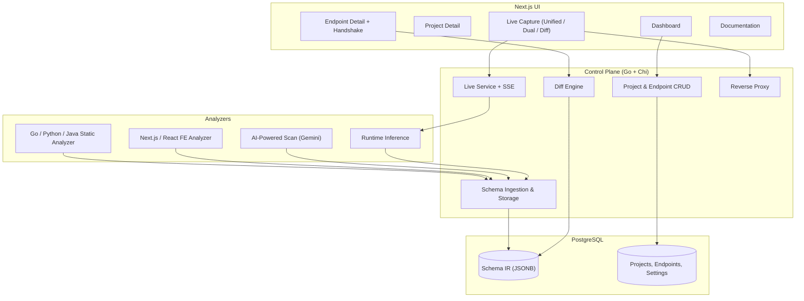
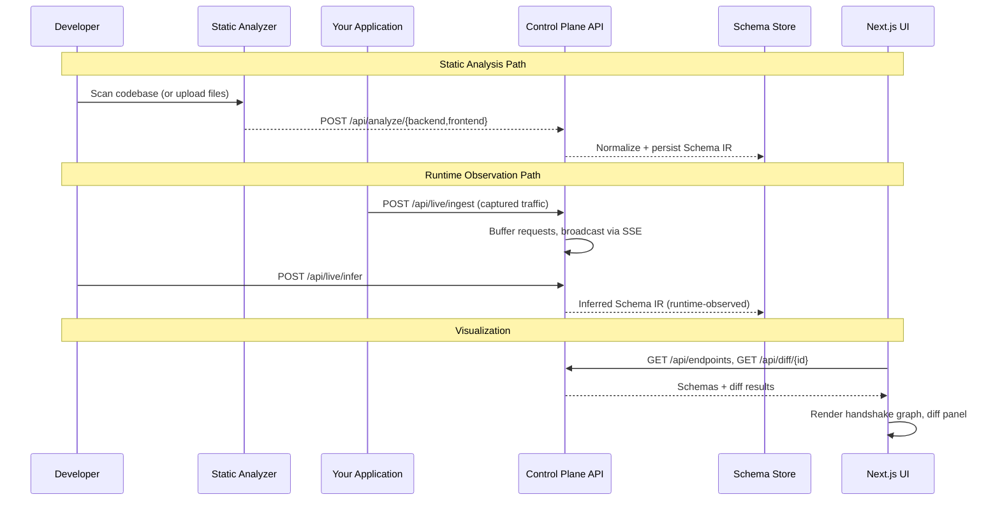
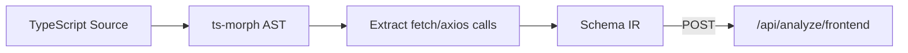
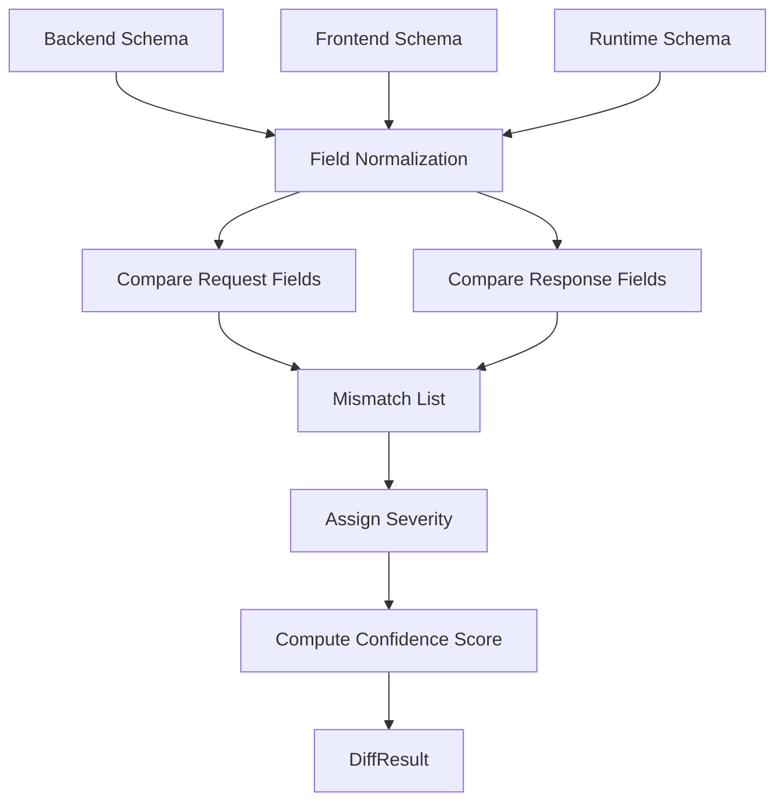
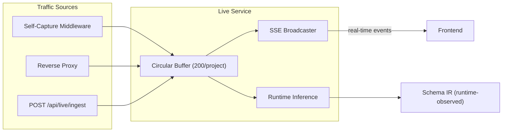
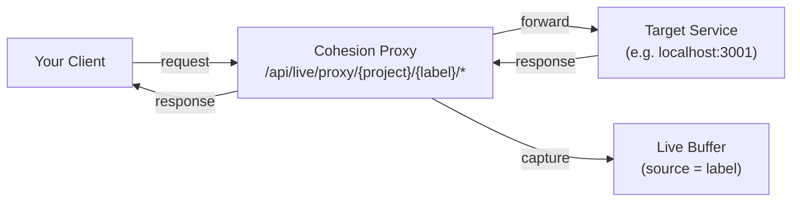
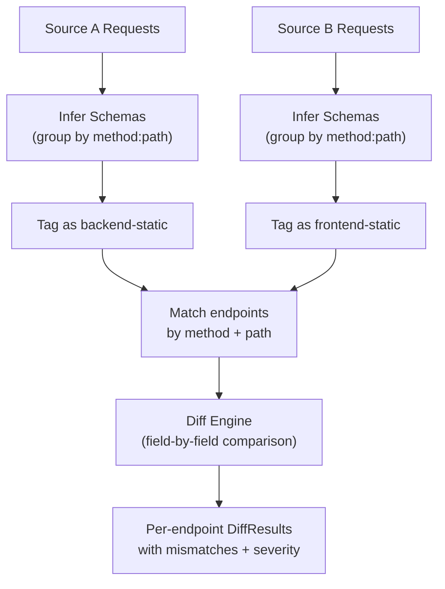
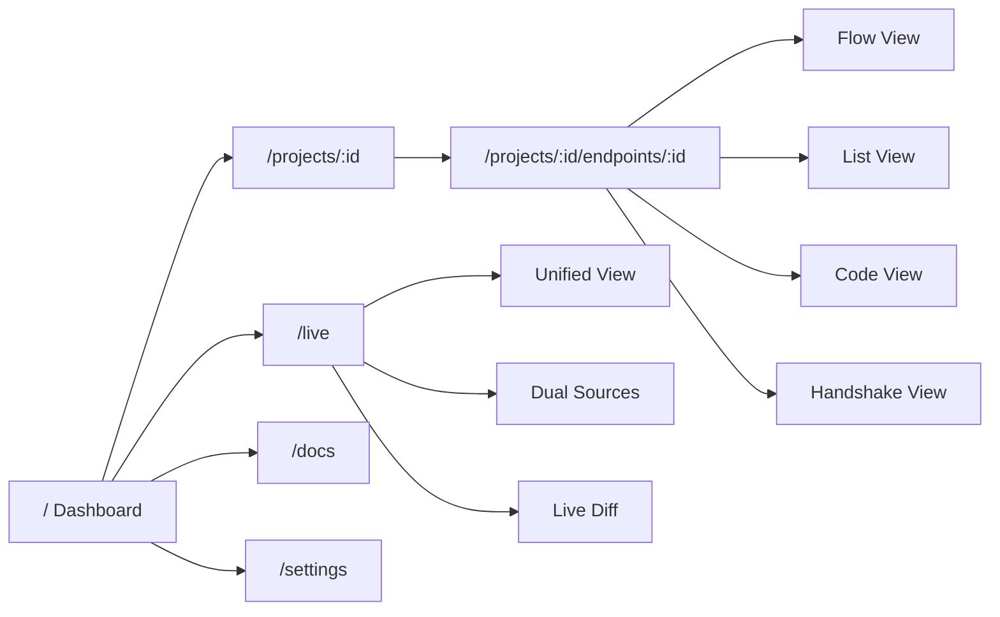

# Cohesion

> A UI-first API contract visualization tool that reconciles what your **frontend intends**, what your **backend implements**, and what actually happens **at runtime**.

Cohesion shows the truth at your system boundaries — not what your docs claim, but what your code and traffic actually do.

---

## Table of Contents

- [What This Project Does](#what-this-project-does)
- [Repository Map](#repository-map)
- [Architecture](#architecture)
- [Schema IR](#schema-ir)
- [Static Analysis](#static-analysis)
- [Diff Engine](#diff-engine)
- [Live Capture](#live-capture)
- [Dual Sources & Reverse Proxy](#dual-sources--reverse-proxy)
- [Live Diff](#live-diff)
- [Frontend UI](#frontend-ui)
- [API Reference](#api-reference)
- [Local Development](#local-development)
- [Extending the System](#extending-the-system)

---

## What This Project Does

Cohesion is a schema aggregation and analysis engine. It collects API contract information from three independent sources and surfaces every mismatch between them:

| Source | How it works | What it represents |
|--------|-------------|-------------------|
| **Backend Static** | AST / AI analysis of server code | What the backend serves and expects |
| **Frontend Static** | AST / AI analysis of client code | What the frontend sends and expects |
| **Runtime Observed** | Live traffic capture + inference | What actually happens at runtime |

Every source produces the same language-agnostic **Schema IR**. The diff engine compares them field-by-field and the UI renders the results as interactive visualizations.

---

## Repository Map

```
cohesion-api/
├── cohesion_backend/          Go control plane, diff engine, live capture, reverse proxy
│   ├── cmd/server/            Entry point
│   ├── internal/
│   │   ├── controlplane/      Chi router + HTTP handlers
│   │   ├── services/          Live service, diff service, schema service
│   │   └── models/            Database models
│   └── pkg/
│       ├── schemair/          Schema IR type definitions
│       ├── diff/              Diff engine (compare, severity, confidence)
│       └── runtime/           Runtime capture middleware + inference
├── cohesion_fe_analyzer/      TypeScript analyzer (ts-morph) for frontend codebases
├── cohesion_frontend/         Next.js App Router UI
│   └── src/
│       ├── app/               Pages: dashboard, project, endpoint, live, docs, settings
│       ├── components/        UI kit, visualizations, live components
│       ├── lib/               API client, types, auth, utilities
│       └── stores/            Zustand state management
└── PRD.md                     Product requirements
```

---

## Architecture

### System Overview



### Data Flow



---

## Schema IR

The **Schema Intermediate Representation** is the backbone of Cohesion. Every analyzer, every inference engine, and every upload produces this format. It is JSON-serializable, deterministic, and language-agnostic.

```json
{
  "endpoint": "/api/users",
  "method": "POST",
  "source": "backend-static",
  "request": {
    "type": "object",
    "fields": {
      "email": { "type": "string", "required": true },
      "name":  { "type": "string", "required": true },
      "role":  { "type": "string", "required": false }
    }
  },
  "response": {
    "201": {
      "type": "object",
      "fields": {
        "id":    { "type": "string", "required": true },
        "email": { "type": "string", "required": true }
      }
    }
  }
}
```

**Key properties:**
- `source` — one of `backend-static`, `frontend-static`, `runtime-observed`
- `request` — the expected request body schema
- `response` — map of HTTP status code to response body schema
- `fields` — each field has a `type`, `required` flag, optional `nested` object, and optional `confidence` (0.0–1.0) for runtime-inferred fields

---

## Static Analysis

Cohesion can analyze codebases in two ways:

### AI-Powered Scan

Upload files or point to a GitHub repo. Cohesion sends the code to the Gemini API, which extracts endpoint definitions and produces Schema IR.

```
POST /api/analyze/scan    — scan local files
POST /api/analyze/github  — scan a GitHub repository
```

Supports: `.go`, `.py`, `.ts`, `.tsx`, `.js`, `.jsx`, `.java`, `.rb`, `.rs`, `.php`

### Direct Schema Upload

If you already have schemas (from OpenAPI, from your own tooling, etc.), upload them directly:

```
POST /api/analyze/backend   — backend schemas
POST /api/analyze/frontend  — frontend schemas
POST /api/analyze/runtime   — runtime-observed schemas
```

### Frontend Analyzer (ts-morph)

The `cohesion_fe_analyzer` package uses ts-morph to statically analyze Next.js/React codebases. It discovers `fetch()` and `axios` calls, extracts URL patterns, HTTP methods, and payload shapes, and outputs Schema IR.



---

## Diff Engine

The diff engine is the core IP of Cohesion. It compares Schema IR from multiple sources for the same endpoint and produces a detailed mismatch report.

### How It Works



### Field Normalization

Before comparing, the engine normalizes field names and types to avoid false positives:

- **Names:** `camelCase`, `PascalCase`, and `kebab-case` are all converted to `snake_case`
- **Types:** equivalent types are grouped — `int/integer/number/float` → `number`, `bool/boolean` → `boolean`, `object/map` → `object`, `array/list` → `array`

### Mismatch Types

| Type | Meaning | Example |
|------|---------|---------|
| `missing` | Field exists in some sources but not others | Backend returns `avatar_url`, frontend doesn't expect it |
| `type_mismatch` | Same field, different types | Backend says `string`, frontend says `number` |
| `optionality_mismatch` | Required in one source, optional in another | Backend requires `role`, frontend sends it optionally |
| `extra_field` | Field only present in one side | Frontend sends `debug_mode`, backend ignores it |

### Severity Levels

The engine assigns severity based on the direction of data flow:

| Severity | When | Impact |
|----------|------|--------|
| **Critical** | Type mismatches; frontend expects a response field the backend doesn't return | Will break at runtime |
| **Warning** | Backend expects a request field the frontend doesn't send; optionality mismatches | May cause validation failures |
| **Info** | Extra fields the other side ignores | Harmless but worth knowing |

### Confidence Scoring

Each diff result includes a confidence score (0–100) reflecting how trustworthy the comparison is:

- **+20** for each source type present (backend, frontend, runtime)
- **+20** bonus when all three sources are present (triple verification)
- **-10** per critical mismatch
- **-3** per warning
- Clamped to 0–100

### Result Statuses

| Status | Meaning |
|--------|---------|
| `match` | No mismatches found — all sources agree |
| `partial` | Only warnings or info-level issues |
| `violation` | At least one critical mismatch |

---

## Live Capture

Live Capture lets you observe real HTTP traffic flowing through your application, then infer runtime schemas from it. This gives you a third source of truth alongside static analysis.

### How It Works



### Three Ways to Capture Traffic

**1. Self-Capture** — Record Cohesion's own API traffic. Start with `POST /api/live/capture/start`. A middleware intercepts every request/response (except `/api/live/*` paths to avoid recursion) and adds it to the buffer with `source: "self"`.

**2. Reverse Proxy** — Configure a proxy target and route external traffic through Cohesion. Every request is forwarded to the real service, and the full request/response pair is captured automatically. See [Dual Sources](#dual-sources--reverse-proxy).

**3. External Ingest** — Add a middleware to your own application that POSTs captured traffic to `POST /api/live/ingest`. Works with any language or framework.

### SSE Streaming

The Live page connects to `GET /api/live/stream?project_id={id}` via Server-Sent Events. Every captured request is broadcast in real time:

```json
{ "type": "request", "payload": { "id": "...", "path": "/api/users", "method": "GET", ... }, "source": "self" }
```

A `"clear"` event is sent when the buffer is flushed.

### Schema Inference

Call `POST /api/live/infer` to convert buffered traffic into Schema IR:

1. Requests are grouped by `method:path`
2. For each endpoint, request bodies and response bodies are merged across observations
3. Fields seen in every request are marked **required**; fields seen in some are marked **optional** with a confidence score
4. The resulting schemas are stored as `runtime-observed` and appear in endpoint views and diffs

### View Modes

The Live page has three tabs:

| Tab | Purpose |
|-----|---------|
| **Unified** | Single chronological stream of all captured requests regardless of source. Click any request to inspect full request/response bodies. Infer schemas from the entire buffer. |
| **Dual Sources** | Side-by-side view of traffic from two different sources. Source selectors in the tab bar let you pick which two to compare. |
| **Live Diff** | Compute a schema diff between two sources' inferred schemas. See [Live Diff](#live-diff). |

---

## Dual Sources & Reverse Proxy

Dual Sources mode lets you capture and compare traffic from two different origins simultaneously.

### What Is a Source?

Every captured request is tagged with a `source` label:
- `"self"` — traffic captured by Cohesion's own middleware
- Any custom label — traffic captured through a configured reverse proxy or tagged in external ingestion

### Setting Up a Reverse Proxy



**Configure a proxy:**

```bash
curl -X POST http://localhost:8080/api/live/proxy/configure \
  -H "Content-Type: application/json" \
  -d '{
    "project_id": "PROJECT_ID",
    "label": "staging-api",
    "target_url": "http://localhost:3001"
  }'
```

This registers a proxy at `http://localhost:8080/api/live/proxy/PROJECT_ID/staging-api/`. Any request sent to this URL is forwarded to `http://localhost:3001`, and the full request/response pair is captured with `source: "staging-api"`.

### How It Works

1. Client sends request to the proxy URL
2. Cohesion reads and buffers the request body
3. The request is forwarded to the target service with the original method, headers, and body
4. The target's response is read and buffered
5. A `LiveRequest` is created with the label as source, full request/response bodies, status code, and duration
6. The request is ingested into the live buffer and broadcast via SSE
7. The original response is returned to the client unchanged

### Using the Dual View

In the Live page, click the **Dual Sources** tab. Two columns appear side by side, each showing traffic from one source. Use the source selectors to pick which sources to compare (e.g. `self` vs `staging-api`).

The **Proxy Sources** configuration panel lets you add, view, and remove proxy targets directly from the UI. Each configured proxy shows a copy button for its proxy URL.

---

## Live Diff

Live Diff compares the runtime-inferred schemas of two traffic sources. Instead of comparing static code analysis, it compares what two services *actually send and receive* at runtime.

### How It Works



**Step by step:**

1. **Infer per source** — The backend groups each source's buffered requests by `method:path` and infers a schema from observed bodies. Fields seen in every request are required; fields seen in some are optional.

2. **Tag schemas** — Source A's schemas are tagged as `backend-static`, Source B's as `frontend-static`. This lets the existing diff engine's directional logic apply correctly.

3. **Match endpoints** — Endpoints are matched across both sets by method and path.

4. **Compute mismatches** — For every matched endpoint, the diff engine compares request and response fields, detecting missing fields, type mismatches, optionality conflicts, and extra fields.

5. **Display results** — The UI shows an endpoint list with status icons on the left and the full mismatch detail on the right.

### Use Cases

| Scenario | How to set it up |
|----------|-----------------|
| **Comparing environments** | Proxy staging and production. Diff to find behavioral drift. |
| **Comparing API versions** | Proxy `/v1` and `/v2`. Live Diff shows which fields changed between versions. |
| **Validating a migration** | Route traffic to old and new service. If Live Diff shows all matches, the new service is behaviourally equivalent. |
| **Frontend vs Backend at runtime** | Capture frontend calls (via proxy) and backend responses (via self-capture). Diff to find what the frontend actually sends vs what the backend actually returns. |

### API

```bash
curl -X POST http://localhost:8080/api/live/diff \
  -H "Content-Type: application/json" \
  -d '{
    "project_id": "PROJECT_ID",
    "source_a": "self",
    "source_b": "staging-api"
  }'
```

Response:

```json
{
  "source_a": "self",
  "source_b": "staging-api",
  "endpoint_count": 3,
  "results": [
    {
      "endpoint": "/api/users",
      "method": "GET",
      "status": "partial",
      "sources_compared": ["backend-static", "frontend-static"],
      "mismatches": [
        {
          "path": "response.200.avatar_url",
          "type": "missing",
          "severity": "warning",
          "description": "Field present in source_a but missing in source_b"
        }
      ]
    }
  ]
}
```

---

## Frontend UI

### Stack

Next.js 14 (App Router), TypeScript, Tailwind CSS, Zustand, React Flow, D3.js, Framer Motion, Clerk (auth), Lucide icons.

### Pages



### Dashboard (`/`)

Project cards showing endpoint counts, schema source badges, and contract health. Onboarding checklist for new users. Global statistics (matched / partial / violations).

### Project Detail (`/projects/:id`)

Endpoint table with method badges, path, source indicators, and status. Upload schemas via scan (local or GitHub) or manual JSON paste. Delete project.

### Endpoint Detail (`/projects/:id/endpoints/:id`)

Split-pane layout:
- **Left panel** — Schema visualization in three modes:
  - **Flow** — Interactive React Flow graph showing request/response field connections
  - **List** — Structured tree view of fields
  - **Code** — Raw Schema IR JSON
  - **Handshake** — Three-column view (Frontend Intent / Agreement / Backend Capability)
- **Right panel** — Diff analysis with mismatch list, severity badges, and suggestions
- **Source tabs** — Switch between backend-static, frontend-static, runtime-observed

### Live Capture (`/live`)

Three view modes (Unified / Dual Sources / Live Diff), project selector, capture controls, proxy source configuration. Real-time SSE streaming. Schema inference.

### Documentation (`/docs`)

Six documentation tabs with interactive code examples, step-by-step guides, and an "On this page" table of contents sidebar with scroll tracking.

### Settings (`/settings`)

Configure Gemini API key and model for AI-powered analysis. Configure GitHub personal access token for repository scanning.

---

## API Reference

### Projects

| Method | Path | Description |
|--------|------|-------------|
| `POST` | `/api/projects` | Create a project |
| `GET` | `/api/projects` | List all projects |
| `GET` | `/api/projects/{id}` | Get project |
| `DELETE` | `/api/projects/{id}` | Delete project |

### Endpoints

| Method | Path | Description |
|--------|------|-------------|
| `GET` | `/api/endpoints?project_id={id}` | List endpoints for a project |
| `GET` | `/api/endpoints/{id}` | Get endpoint with schemas |

### Schema Analysis

| Method | Path | Description |
|--------|------|-------------|
| `POST` | `/api/analyze/backend` | Upload backend schemas |
| `POST` | `/api/analyze/frontend` | Upload frontend schemas |
| `POST` | `/api/analyze/runtime` | Upload runtime schemas |
| `POST` | `/api/analyze/scan` | AI scan local codebase |
| `POST` | `/api/analyze/github` | AI scan GitHub repository |

### Diff

| Method | Path | Description |
|--------|------|-------------|
| `GET` | `/api/diff/{endpointId}` | Compute diff across all sources |
| `GET` | `/api/stats` | Aggregated match/partial/violation counts |

### Live Capture

| Method | Path | Description |
|--------|------|-------------|
| `POST` | `/api/live/ingest` | Ingest captured requests |
| `GET` | `/api/live/requests?project_id={id}` | Get buffered requests |
| `GET` | `/api/live/stream?project_id={id}` | SSE stream of live events |
| `POST` | `/api/live/infer` | Infer schemas from buffer |
| `POST` | `/api/live/clear` | Clear buffer |
| `POST` | `/api/live/capture/start` | Start self-capture middleware |
| `POST` | `/api/live/capture/stop` | Stop self-capture middleware |
| `GET` | `/api/live/sources?project_id={id}` | List distinct source labels |
| `POST` | `/api/live/diff` | Diff two sources' inferred schemas |
| `POST` | `/api/live/proxy/configure` | Register a reverse proxy target |
| `*` | `/api/live/proxy/{projectId}/{label}/*` | Reverse proxy passthrough |

### User Settings

| Method | Path | Description |
|--------|------|-------------|
| `GET` | `/api/user/settings` | Get settings (keys masked) |
| `PUT` | `/api/user/settings` | Save Gemini key, model, GitHub token |

---

## Local Development

### Prerequisites

- Go 1.22+
- Node 18+
- PostgreSQL (or adjust config for SQLite)
- (Optional) Gemini API key for AI-powered analysis
- (Optional) GitHub token for repo scanning

### Backend

```bash
cd cohesion_backend
go run ./cmd/server
# Runs on :8080 by default
```

### Frontend

```bash
cd cohesion_frontend
npm install
npm run dev
# Runs on :3000 by default
```

### Frontend Analyzer (optional)

```bash
cd cohesion_fe_analyzer
npm install
npm run build
```

### Quick Start

1. Start the backend and frontend
2. Create a project from the dashboard
3. Upload or scan schemas (backend + frontend)
4. Open an endpoint to see the handshake view and diff
5. Go to Live Capture, start self-capture, browse the UI, then infer schemas to get runtime data

---

## Extending the System

### Adding a New Analyzer

Emit Schema IR and POST to `/api/analyze/{backend,frontend,runtime}`. The diff engine and UI work unchanged — they only consume Schema IR.

### Adding a New Visualization

Consume `/api/endpoints/{id}` (schemas) and `/api/diff/{id}` (mismatches). The IR is purposefully simple and deterministic.

### Adding a New Runtime Source

Any service that can POST captured request/response pairs to `/api/live/ingest` can participate. The Go middleware in `pkg/runtime` is just the reference implementation. Express, FastAPI, and Go middleware examples are in the docs page.

### Adding a New Proxy Target

`POST /api/live/proxy/configure` with a label and target URL. Traffic routed through the proxy is automatically captured and tagged. No code changes needed.

---

## Security & Privacy

- Runtime capture is opt-in — must be explicitly started
- Static analysis performs no code execution (AST / AI only)
- Request/response bodies are buffered in-memory with a 200-request circular buffer per project
- API keys (Gemini, GitHub) are stored encrypted and masked in API responses
- Self-capture excludes `/api/live/*` paths to prevent recursive capture
- CORS is configured on the backend — adjust for production deployments

---

*Built with Go, Next.js, and a belief that API contracts should be visible, inspectable, and provable.*
